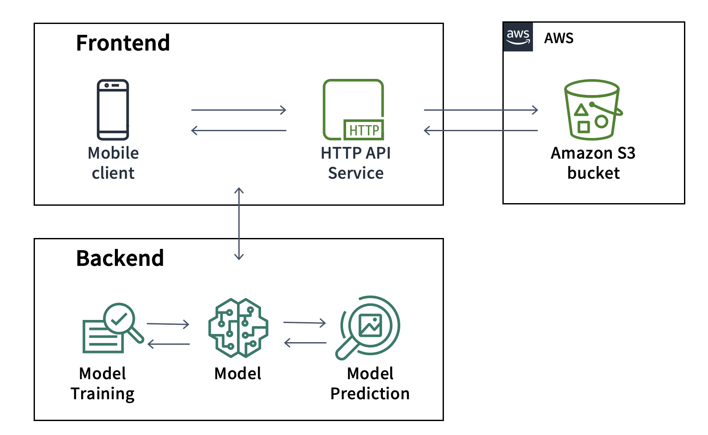
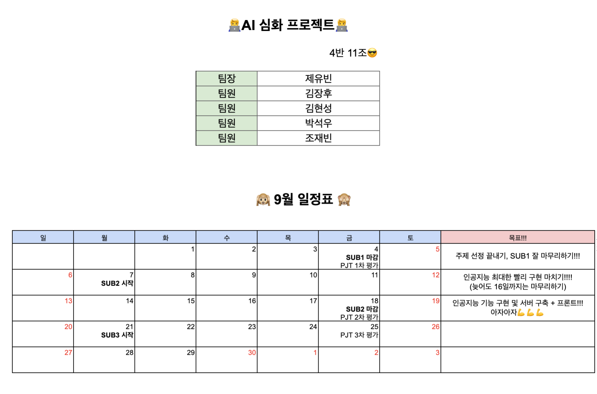
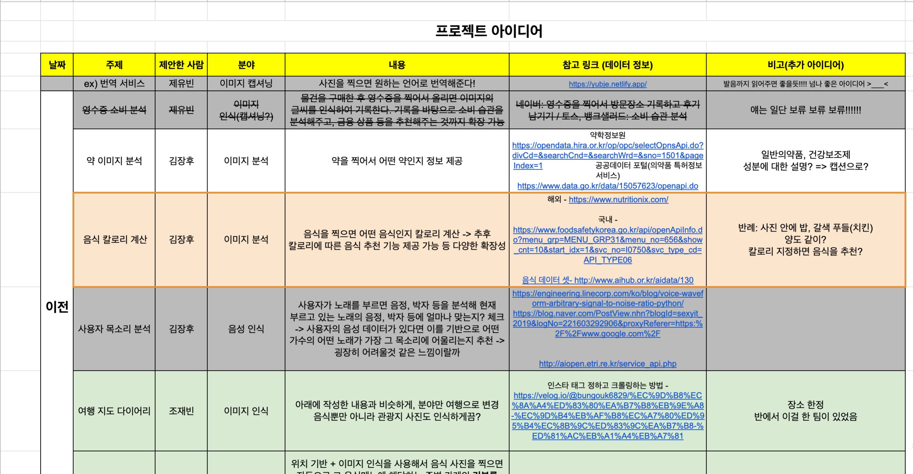
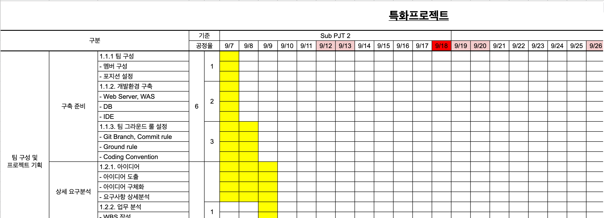
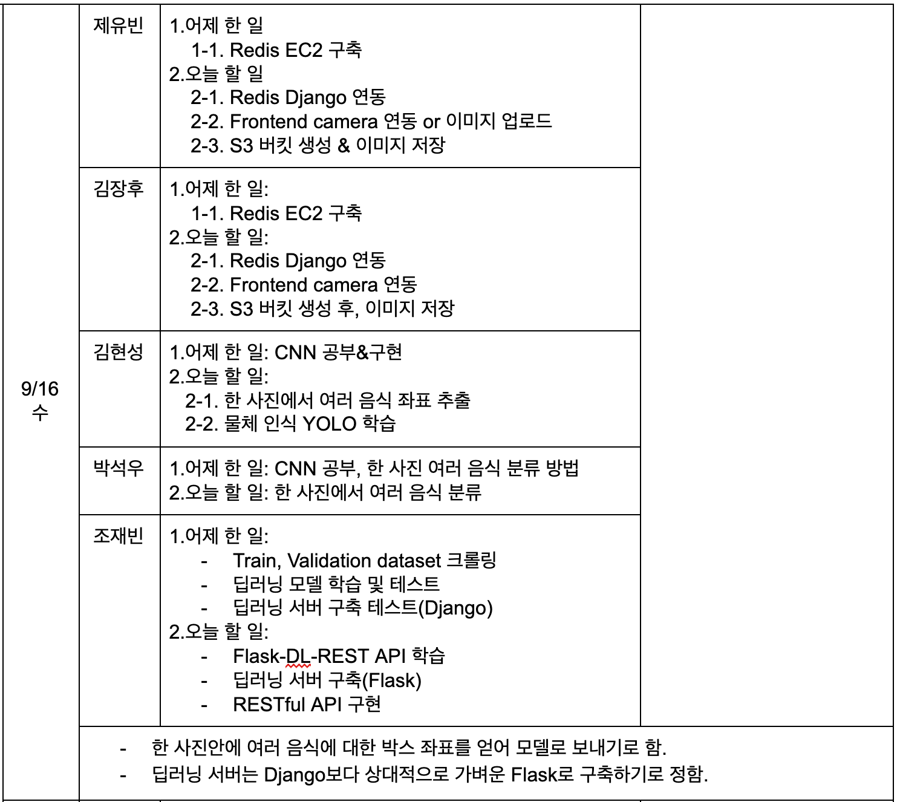

# food2cal

> 음식 사진을 찍거나 업로드하면 칼로리 정보를 확인할 수 있는 인공지능 서비스 입니다.

## Development

### 🧑‍💻 Developers

👤 **김장후** 👤 **김현성** 👤 **박석우** 👤 **제유빈**(팀장) 👤 **조재빈**

### 📆 Schedule

**2020-09-07 ~ 2020-09-18**

## 📖 Architecture

## 💻  Technology Stack

#### 📌 Frontend: Vue.js

#### 📌 AI: Flask

#### 📌 Image Storage: AWS S3

### Core Technology  

**Flask**: food2cal 의 머신러닝 기능 구현

**Tensorflow**: 머신러닝 기능 구현

**Vue.js**: food2cal의 프론트엔드 기능 구현

**Axios**: http 통신 라이브러리, 비동기 통신 요청 처리

**AWS**: EC2 서비스를 이용하여 Ubuntu 서버 구축, S3 서비스를 이용하여 이미지 스토리지 구축

### Communictaion

#### Goole Spreadsheet

* Main

* Idea

* Reference

* Milestone

#### Daily Meeting (Google Docs)

### Further Info

* 그라운드룰, 기능 구현하면서 공부한 내용, 발표 자료 등은 [여기](https://lab.ssafy.com/s03-ai-sub2/s03p22a411/tree/master/docs) 에서 확인하실 수 있습니다!