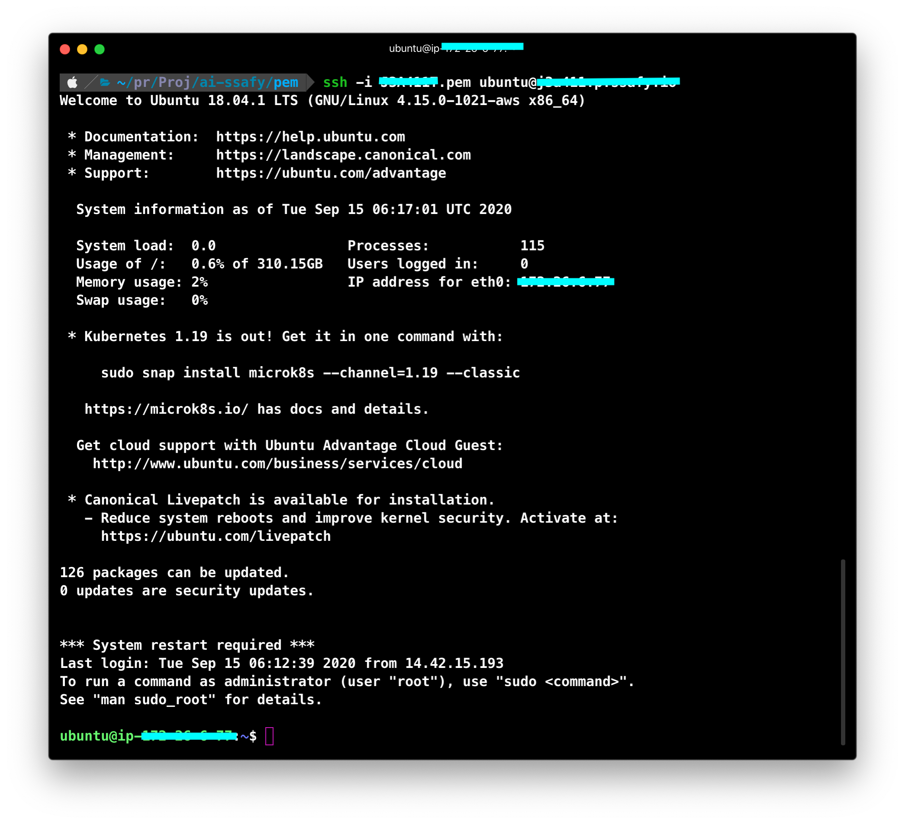
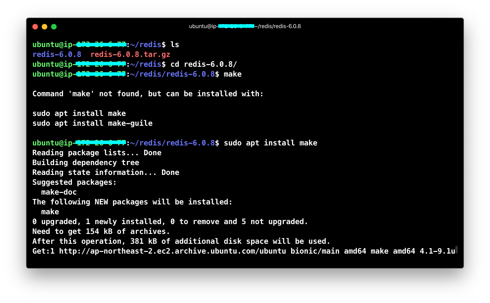
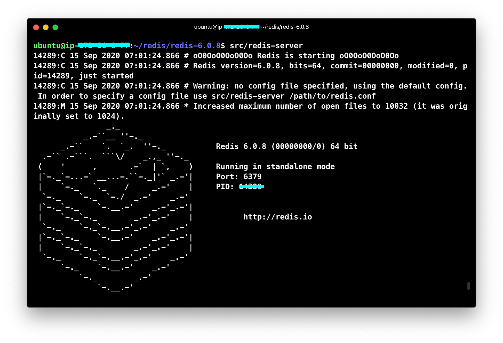
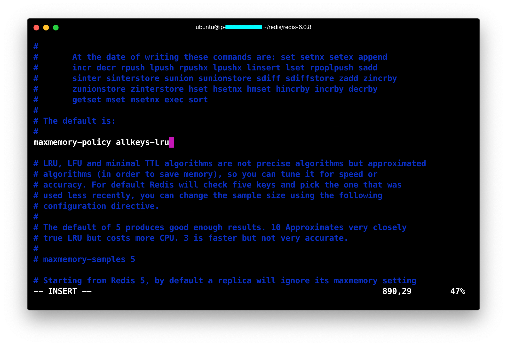
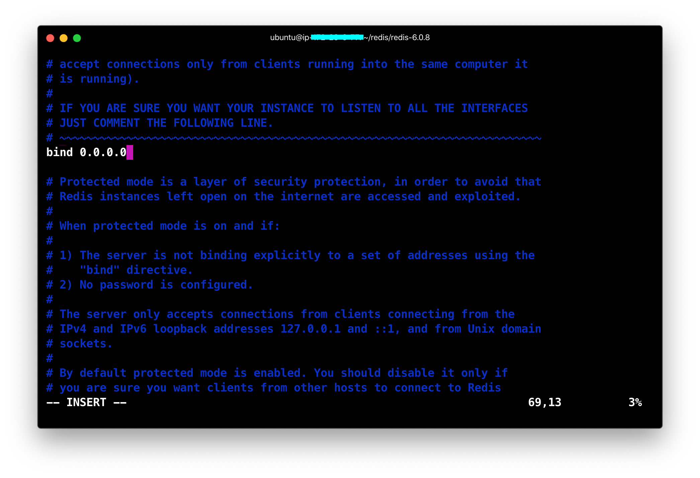
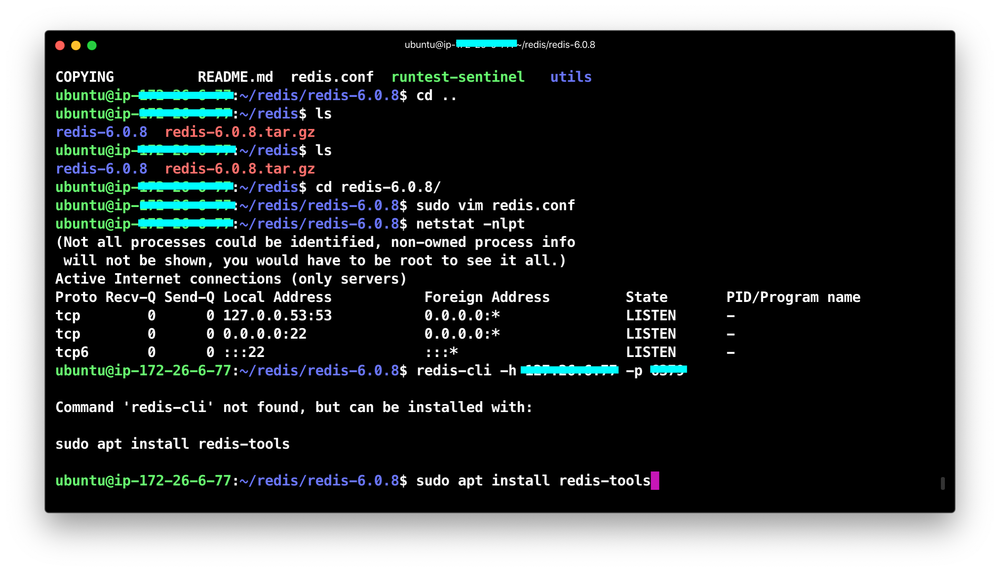

# Cache Server

## Summary

---

1. [Run AWS EC2 ](#1.-Run-AWS-EC2)
2. [Install Redis](#2.-Install-Redis)
3. [Redis Settings](#3.-Redis-Settings)
4. [Check](4.-Check)

---

## 1. Run AWS EC2

### 1-1. EC2 접속하기

* 리눅스 또는 GIt Bash 등

  * ssh -i PEM파일명 ubuntu@서버명
  * putty 이용 시, puttygen으로 pem파일을 ppk로 변환하여 ubuntu@서버명(22번 포트)으로 접속
  
  
  
  > 다음과 같이 정보를 확인할 수 있다. 
  
  

### 1-2. 저장소 업데이트 및 업그레이드

* 패키지를 최신 버전으로 바꾸어 준다. 

```bash
$ sudo apt-get update
$ sudo apt-get upgrade
```

> ubuntu에서는 apt 명령어를 이용하여 패키지를 관리한다. 


## 2. Install Redis


### 2-1. Redis 디렉토리 생성 후 설치

* `redis` 디렉토리를 생성한 후 들어간다.

```bash
$ mkdir redis
$ cd redis
```


* Redis 를 설치한다.

```bash
$ wget http://download.redis.io/releases/redis-6.0.8.tar.gz
$ tar xzf redis-6.0.8.tar.gz
$ cd redis-6.0.8
$ make
```


* `make` 가 설치가 되어있지 않은 경우 설치해 준

```bash
$ sudo apt install make
```



* redis를 실행한다.




## 3. Redis Settings

## 3. Redis Settings

* redis.conf 파일 접근

```bash
~/redis/redis-6.0.8/src $ sudo vim redis.conf
```

> 현재 위치에 redis.conf가 있는 경우 다음과 같은 명령어로 실행하고, 현재 위치에 없는 경우는 경로를 적어 파일에 접근한다. Ex. `sudo vim /redis/redis-6.0.8/src/redis.conf`


* 설정 파일에서 원하는 단어 검색

> `/ 검색어` + `Enter`  로 검색 가능하며, 다음 검색어를 보고 싶을 때는 `n` 키를 눌러서 이동한다.
>
> Ex. `/ maxmemory` -> `Enter` -> `n`


### 3-1. maxmemory 관련 설정

> maxmemory는 최대 메모리 사용량을 지정해 주는 설정으로, 기본적으로 64bit 환경에서는 0, 32bit 환경에서는 3GB로 설정되어 있다.
>
> Maxmemory-policy는 메모리 정책이며, 기본적으로는 캐시를 지우지 않는 정책인 noeviction으로 설정되어 있다. 


* maxmemory 설정


> maxmemory 를 2GB로 설정해 준다.


* maxmemory-policy 설정



> noeviction => allkeys-lru로 설정을 변경한다. 다양한 정책으로 설정이 가능하다. 


| 정책명          | 설명                                                         |
| --------------- | ------------------------------------------------------------ |
| noeviction      | 기존 데이터 삭제 X. 메모리 한계에 도달하면 OOM 오류 반환, 새 데이터 저장 X |
| allkeys-lru     | [LRU](https://zetawiki.com/wiki/%EC%B5%9C%EA%B7%BC%EC%B5%9C%EC%86%8C%EC%82%AC%EC%9A%A9_LRU) 로 삭제하여 공간확보하고 새 데이터 저장 |
| volatile-lru    | expire set을 가진 것 중 LRU로 삭제하여 공간확보하고 새 데이터 저장 |
| allkeys-random  | 랜덤으로 삭제하여 공간확보하고 새 데이터 저장                |
| volatile-random | expire set을 가진 것 중에서 랜덤으로 삭제하여 공간확보하고 새 데이터 저장 |
| volatile-ttl    | expire set을 가진 것 중 TTL이 짧은 것부터 삭제하여 공간확보하고 새 데이터 저장 |


### 3-2. bind 설정 변경

* 외부에서 접속을 변경해 주기 위해 bind 설정을 변경한다.



> 우선 모든 접속을 허용해 주기 위해 0.0.0.0으로 변경한다.


## 4. Check

### 4-1. 포트 접속 권한 확인

* 레디스 서버가 설치된 서버에 명령어를 입력해 포트의 접속 권한을 확인한다.

```bash
$ netstat -nlpt
```



> 다음과 같이 0.0.0.0으로 접속 권한이 열려 있다는 것을 확인할 수 있다.


### 4-2. 클라이언트로 접속

* redis-tools 설치

```bash
$ sudo apt-get install redis-tools
```

> 클라이언트로 접속하기 전에 redis-server 혹은 redis-cli가 설치 되어져 있어야 하므로 redis-tools를 먼저 설치한다.


* redis-cli 실행

```bash
~/redis/redis-6.0.8$ src/redis-cli
~/redis/redis-6.0.8$ src/redis-cli -h {IP주소} -p {포트 번호} -a 비밀번호
```

> 다음과 같은 명령어로 redis-cli에 접속할 수 있다. 


* 동작 확인 방법

  1. key, value값을 넣어 본다.

  ```bash
  {IP주소}:{포트 번호}> set {key} {value}
  ```

  2. key 값을 이용해 value 값을 꺼낸다.

  ```bash
  {IP주소}:{포트 번호}> get {key}
  ```

  > 해당 명령어 입력시 value값이 출력되는 것을 확인할 수 있다. 


---

## References

* [redis 공식문서-설치](https://redis.io/download)

* [ec2에 redis설치](https://alsyean.tistory.com/51)

* [redis 설정](https://medium.com/@dlaudtjr07/redis-redis-%EA%B0%9C%EB%85%90-aws-ec2%ED%99%98%EA%B2%BD%EC%97%90%EC%84%9C-%EC%84%A4%EC%B9%98%ED%95%98%EA%B8%B0-a510cdb9731e)

* [maxmemory-policy 종류](https://zetawiki.com/wiki/%EB%A0%88%EB%94%94%EC%8A%A4_%EC%84%A4%EC%A0%95_maxmemory-policy)

* [LRU 설명](https://zetawiki.com/wiki/%EC%B5%9C%EA%B7%BC%EC%B5%9C%EC%86%8C%EC%82%AC%EC%9A%A9_LRU)