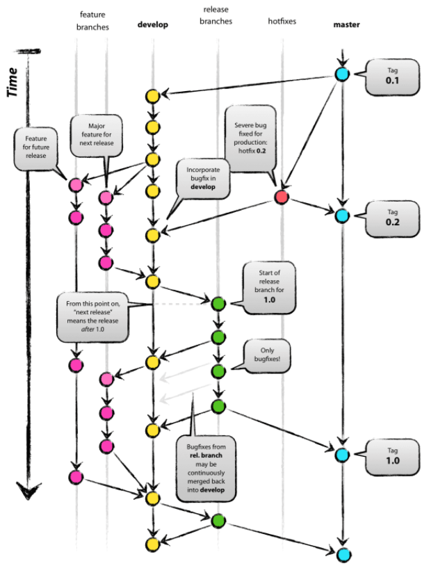

# Ground Rule

## 0. Introduction

원활한 협업과 개발자로의 성장을 위해 다음과 같은 Ground Rule을 설정하고, 이를 준수하며 개발을 진행하도록 약속한다.

## 1. Team Ground Rules

- 진행 상황 **적극적으로** 공유하기

## 2. Git Convention

### 1. Git Branch Strategy

#### 1. Branch Rule

Branch 명은 다음과 같은 규칙으로 생성 및 관리한다.

- master: 제품으로 출시될 수 있는 브랜치
- develop: 다음 출시 버전을 개발하는 브랜치
- feature: 기능을 개발하는 브랜치
- release: 이번 출시 버전을 준비하는 브랜치
- hotfix: 출시된 버전에서 발생한 버그를 수정하는 브랜치

#### 2. Process

다음과 같은 절차로 진행한다.

1. `master` 브랜치에서 `develop` 브랜치를 분기하여 `develop` 브랜치에서 개발을 진행한다.
2. 기능 구현이 있는 경우 `develop` 브랜치에서 `feature/{기능명}` 브랜치를 분기한다. ex) `feature/frontend`
3. `feature/{기능명}`브랜치에서 `{기능명}/{상세내용}` 브랜치를 분기한다. ex) `frontend/login`
4. 작업 중 다른 브랜치에서 완료된 기능(`develop`브랜치로 merge가 완료된 기능)이 필요하다면 현재 브랜치로 `develop` 브랜치를 merge한다.
5. merge는 역순으로 진행하되, 먼저 다른 기능 개발이 완료되었다면 현재 브랜치에 merge한 후 진행한다.
6. 배포할 기능 구현이 완료되었다면 `develop` 브랜치에서 `release-{배포 버전}` 브랜치를 분기한다. ex) `release-1.0.0`
7. `release-{배포 버전}` 가 만들어지면 집중적으로 버그를 수정한다.
8. `release-{배포 버전}` 브랜치에서 QA 를 진행하고, 발생한 버그는 `release-{배포 버전}` 브랜치에 직접 반영한다.
9. 테스트가 완료되면 `release-{배포 버전}` 브랜치를 `master`와 `develop`에 머지한다.
10. 배포된 버전에 버그가 발생하였다면 `master` 브랜치에서 `hotfix` 브랜치를 분기하여 버그를 수정한다.
11. `master`브랜치와 `develop`브랜치 를 메인 브랜치로 항상 유지하고, 모든 브랜치는 생성 후 각 역할이 종료되면 삭제하는 것을 규칙으로 한다.

### 2. Git Commit Rule

#### 1. Commit Type

- \[feat]: 새로운 기능 추가
- \[fix]: 버그 수정
- \[docs]: 문서 수정
- \[style]: 코드 포맷팅, 세미콜론 누락 등 (동작에 영향을 주지 않는 코드)
- \[refactor]: 코드 리팩토링
- \[test]: 테스트 코드 추가
- \[chore]: 빌드 업무 수정, 패키지 매니저 설정 등 위에 해당되지 않는 모든 변경

#### 2. Subject

- 제목은 50자를 넘기지 않는다.
- 첫 글자는 대문자로 작성한다.
- 시제 없이 명령문으로 작성한다.

#### 3. Jira issue number

- 커밋 메시지의 마지막에 지라 이슈번호를 추가한다.

#### 4. Example

- [feat] Create README.md | S03P22A411-1

- [style] Modify main page layout | S03P22A411-2

## 3. Coding Convention

> - 코딩 컨벤션은 코드를 작성할 때 사용되는 기준으로, 세세한 규칙을 설정하여 이를 준수하기 위함을 목적으로 한다.
> - 이를 습관화하여 원활한 협업과 동시에 나은 품질의 코드를 작성한다.

### 1. Python

> 참조: [python documentation(PEP 8)](https://www.python.org/dev/peps/pep-0008/)

#### 1. Code Lay-out

- 들여쓰기는 공백 4칸으로 작성한다.
- 최상위 함수와 클래스 정의는 2줄씩 띄어 쓴다.
- 클래스 내의 메소드 정의는 1줄씩 띄어 쓴다.

#### 2. Whitespace in Expressions and Statements

- 다음과 같은 곳의 불필요한 공백은 피한다.
  - 대괄호([])와 소괄호(()) 안
  - 쉼표(,), 콜론(:), 세미콜론(;) 앞
- 키워드 인자(keyword argument)와 인자의 기본값(default parameter value)의 `=`는 붙여 쓴다.

#### 3. Comments

- 항상 코드에 따라 주석은 갱신한다.
- 불필요한 주석은 달지 않는다.
- 한 줄 주석은 신중히 단다.
- **사용하지 않는 코드 주석 금지**

#### 4. Naming Conventions

- 변수명에서 _(밑줄)은 위치에 따라 다음과 같은 의미를 가진다.
  - _single_leading_underscore: 내부적으로 사용되는 변수
  - single_trailing_underscore_: 파이썬 기본 키워드와 충돌을 피하기 위함
  - double_leading_underscore: 클래스 속성으로 사용되면 그 이름을 변경한다. (ex. FooBar에 정의된 boo는 _FooBar__boo로 바뀜)
  - double_leading_and_trailing_underscore: [마술(magic)](http://en.wikipedia.org/wiki/Magic_/(programming/))을 부리는 용도로 사용되거나 사용자가 조정할 수 있는 네임스페이스 안의 속성을 뜻한다. 이런 이름을 새로 만들지 않고 오직 문서대로만 사용한다.
- 소문자 L, 대문자 O, 대문자 I는 변수명으로 사용하지 않는다. 어떤 폰트에서는 가독성이 굉장히 안 좋음
- **모듈(Module) 명**은 **짧은 소문자**로 구성되며 필요하다면 밑줄로 나눈다.
  - 모듈은 파이썬 파일(.py)에 대응하기 때문에 파일 시스템의 영향을 받으니 주의
  - C/C++ 확장 모듈은 밑줄로 시작한다.
- **클래스 명**은 **카멜케이스(CamelCase)**로 작성한다.
  - 내부적으로 쓰이면 밑줄을 앞에 붙인다.
  - 예외(Exception)는 실제로 에러인 경우엔 “Error”를 뒤에 붙인다.
- **함수명**은 **소문자**로 구성하되 필요하면 밑줄로 나눈다.
  - 대소문자 혼용은 이미 흔하게 사용되는 부분에 대해서만 하위호환을 위해 허용
- 인스턴스 메소드의 첫 번째 인자는 언제나 `self`
- 클래스 메소드의 첫 번째 인자는 언제나 `cls`
- 메소드명은 함수명과 같으나 비공개(non-public) 메소드, 혹은 변수면 밑줄을 앞에 붙인다.
- 서브 클래스(sub-class)의 이름충돌을 막기 위해서는 밑줄 2개를 앞에 붙인다.
- **상수(Constant)**는 **모듈 단위에서만 정의하며 모두 대문자**로 작성, 필요하다면 밑줄로 나눈다.

**명시되지 않은 코딩 컨벤션은 [파이썬 공식문서](https://www.python.org/dev/peps/pep-0008/)를 참조한다.**

