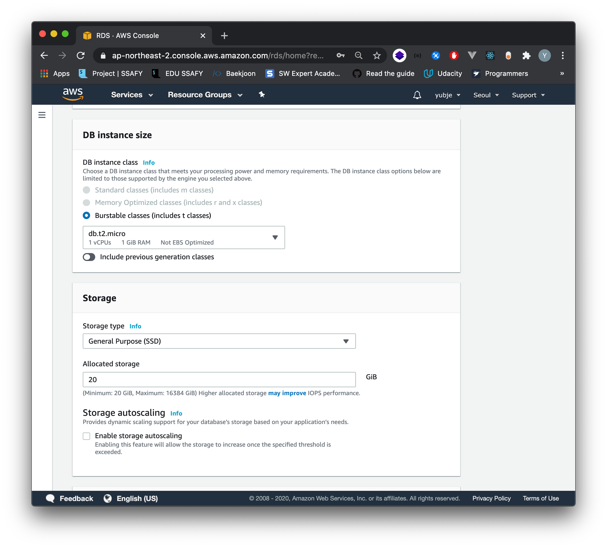
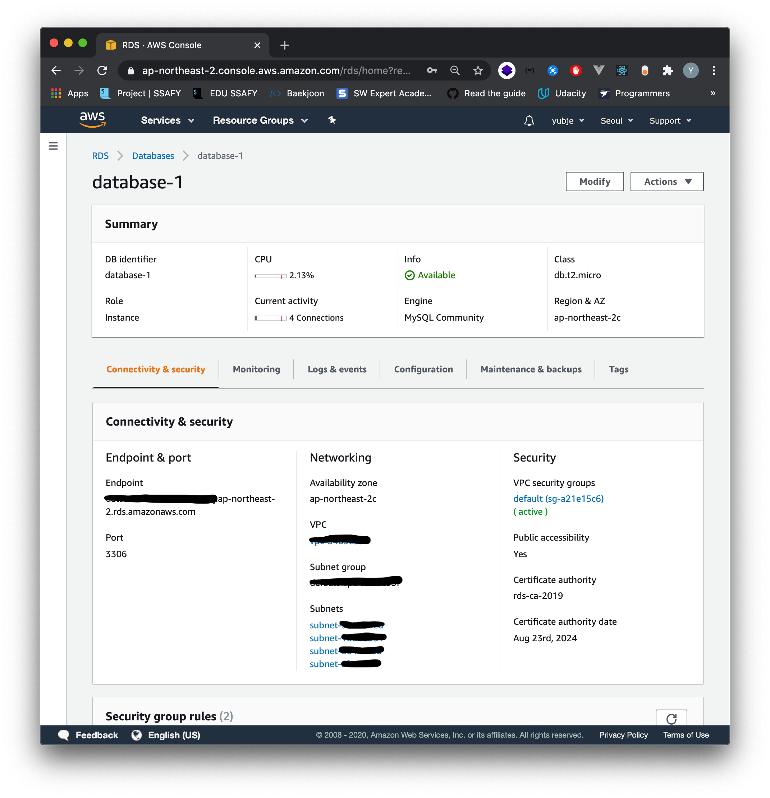
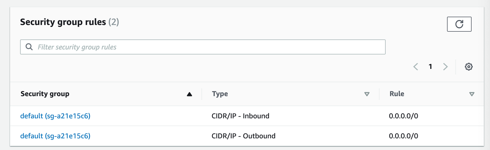
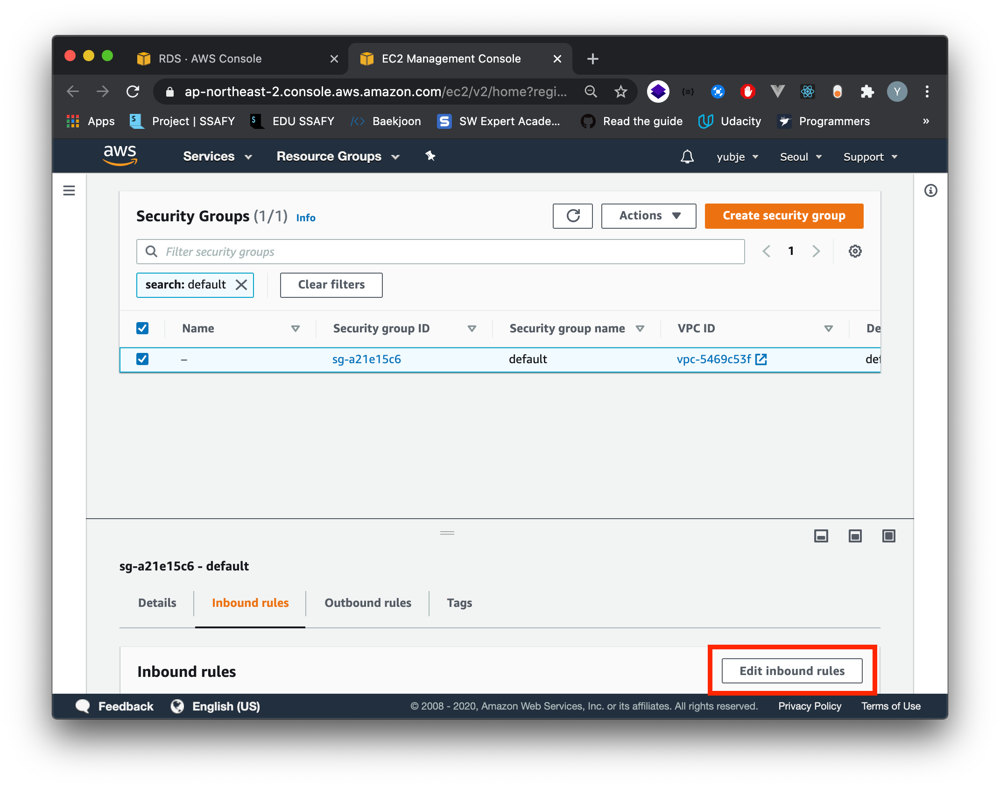
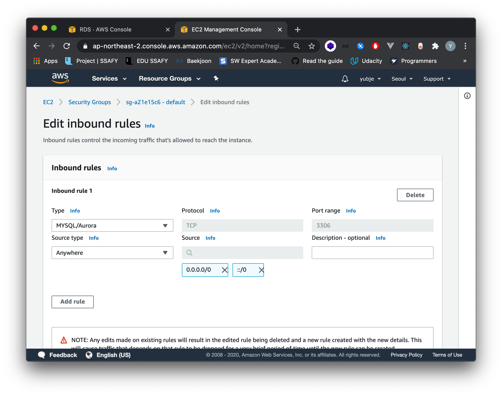
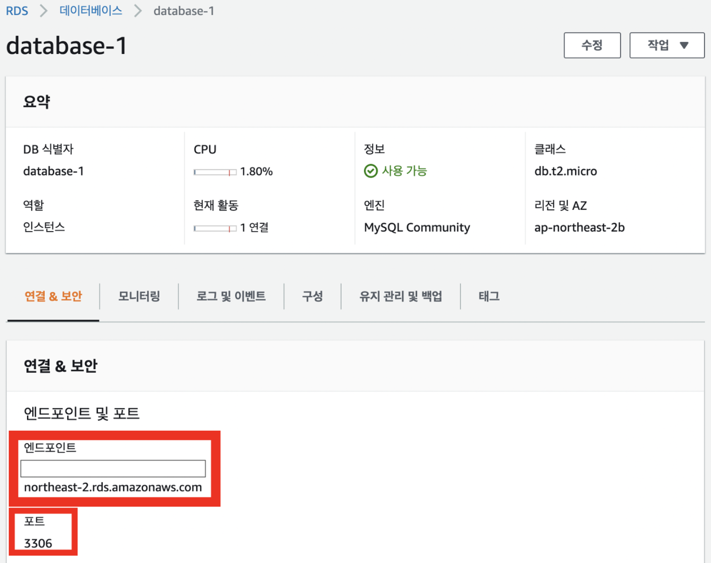
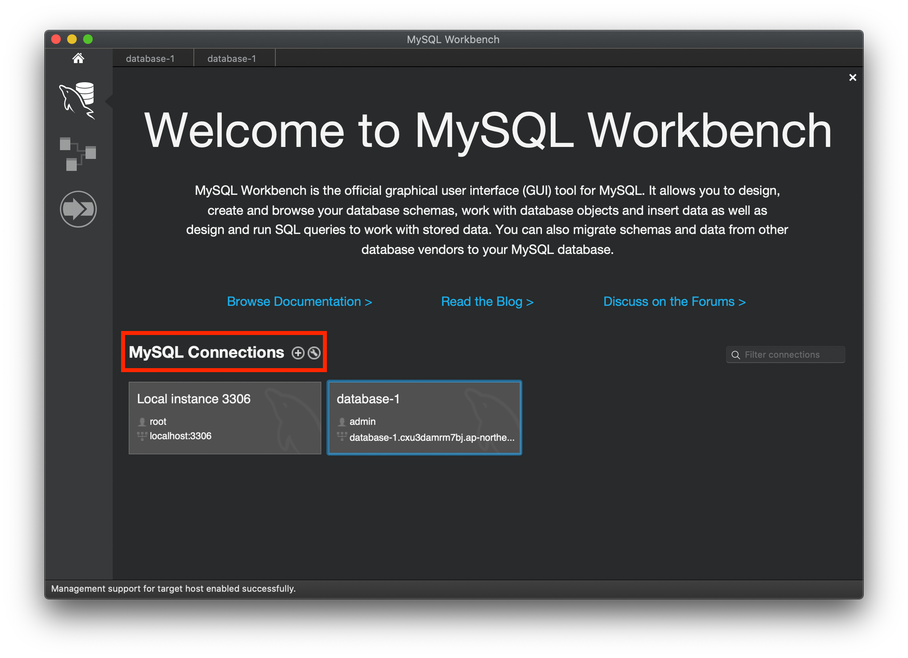
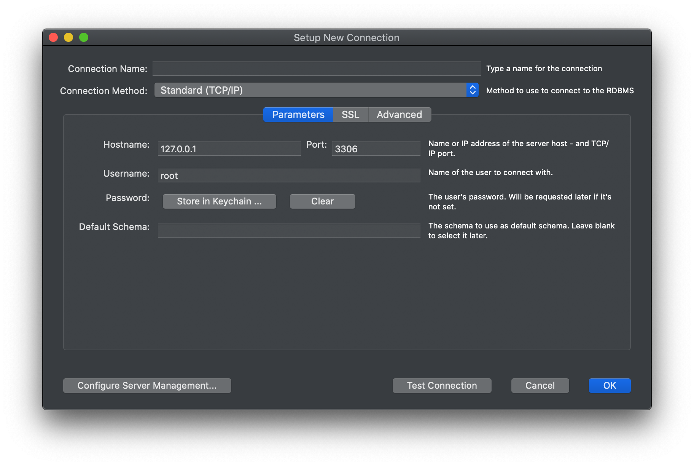

# Django MySQL connection
## Summary
---
1. [AWS RDS Instance](#1.-AWS-RDS-Instance)
2. [Connect MySQL](#2.-Connect-MySQL)
---
## Learning
---
## 1. AWS RDS Instance
### 1-1. Instance 생성
* [Amazon RDS for MySQL](https://aws.amazon.com/ko/rds/mysql/) 인스턴스 생성

  

  > AWS > RDS > Create database

  

  * Templates를 Free tier로 설정하면 750시간동안 20GB의 스토리지를 무료로 사용할 수 있다.

  * Settings에서 인스턴스명과 마스터 유저 정보를 입력한다.

    

  

  * 주의!
    * 스토리지 자동 조정 활성화(Enable storage autoscaling)를 체크하면 과금이 될 수 있으므로 해제한다!
    * '추가 연결 구성'에서 '퍼블릭 액세스 가능(Public accessibility)' 여부를 '예' 처리한다.

  

  * 인스턴스 상세 정보 확인 

  

* AWS RDS 생성 후 사용하기 (인바운드 규칙 설정)

  1. DB 인스턴스 상세 정보 > 보안 그룹(Security group rules) > Type가 Inbound인 보안 그룹(Security group) 선택

  

  2. 인바운드 규칙 편집 설정 

     

     3. 다음과 같이 인바운드 규칙을 설정한 후 저장한다. 

     

     

* [MySQL 데이터베이스 생성 및 연결](https://aws.amazon.com/ko/getting-started/hands-on/create-mysql-db/)

  * AWS RDS 콘솔에 들어가서 엔드포인트(Endpoint) 정보와 포트(port) 정보를 확인한다.

  

  * MySQL workbench에서 'MySQL Connections' 옆의 + 버튼을 눌러 새로운 Connections을 생성한다.

  

  * 새로운 커넥션 생성 화면에서 'Host name'에는 RDS의 'Endpoint' 정보를 입력하고, 'port'에는 RDS의 'port' 번호를 입력한다. 그리고 'Username'에 RDS의 'Master User' 계정 정보를 입력한 후 Test Connection을 실행해 본다.

  

  * 다음과 같은 에러가 나오는 경우 RDS에서 퍼블릭 엑세스 가능 설정을 해주지 않아 나는 에러이므로 설정해 준다.   

    

  * 정상적으로 작동하는 경우 다음과 같은 메세지를 확인할 수 있다.

    

* [rds 파라미터 그룹 설정](https://hoonmaro.tistory.com/53)

### 1-2. Workbench 연결하기
* [MySQL Workbench](https://dev.mysql.com/downloads/workbench/) 설치
* Database -> Manage Connections -> New

* Hostname: AWS 데이터베이스 앤드포인트 입력
* Username: 기존에 설정한 Instance Username 입력
* Password: 기존에 설정한 Instance Password 입력
* Test Connection -> Success
* Schema 생성

## 2. Connect MySQL
### 2-1. RDS 정보 저장
* secrets.json 파일 생성 후 gitignore에 추가
```json
{
  "USER": "username",
  "PASSWORD": "password",
  "HOST": "host"
}
```
### 2-2. Django settings.py connect
* secrets.json 파일 불러오기
```python
import os, json
from django.core.exceptions import ImproperlyConfigured

# Build paths inside the project like this: os.path.join(BASE_DIR, ...)
BASE_DIR = os.path.dirname(os.path.dirname(os.path.abspath(__file__)))

secret_file = os.path.join(BASE_DIR, 'secrets.json') # secrets.json 파일 위치를 명시

with open(secret_file) as f:
    secrets = json.loads(f.read())


# Keep secret keys in secrets.json
def get_secret(setting, secrets=secrets):
    try:
        return secrets[setting]
    except KeyError:
        error_msg = "Set the {0} environment variable".format(setting)
        raise ImproperlyConfigured(error_msg)
```
* Modify DATABASES
```python
DATABASES = {
    'default': {
        'ENGINE': 'django.db.backends.mysql',
        'NAME': 'test',
        'USER': get_secret("USER"),
        'PASSWORD': get_secret("PASSWORD"),
        'HOST': get_secret("HOST"),
        'PORT': '3306',
        'OPTIONS': {
            'init_command': 'SET sql_mode="STRICT_TRANS_TABLES"'
        }
    }
}
```
* app 생성 -> modeling -> makemigrations -> migrate -> showmigrations

## 3. Multi Schema

---
## References
* [Amazon RDS for MySQL](https://aws.amazon.com/ko/rds/mysql/)
* [AWS RDS 인스턴스 생성](https://velog.io/@joker/createawsrds)
* [MySQL 데이터베이스 생성 및 연결](https://aws.amazon.com/ko/getting-started/hands-on/create-mysql-db/)
* [MySQL 데이터베이스 엔진 기반 DB 인스턴스에 연결하기](https://docs.aws.amazon.com/ko_kr/AmazonRDS/latest/UserGuide/USER_ConnectToInstance.html)
* [AWS RDS Django 데이터베이스 설정](https://velog.io/@dojun527/AWS-RDS-Django-%EB%8D%B0%EC%9D%B4%ED%84%B0%EB%B2%A0%EC%9D%B4%EC%8A%A4-%EC%84%A4%EC%A0%95)
* [AWS RDS 생성과 기본 설정](https://hoonmaro.tistory.com/53)
* [장고 MySQL 연동](https://velog.io/@koozzi/Django-AWS-RDSMySQL-%EC%97%B0%EB%8F%99)
* [장고 MySQL 연동 처리 :: 마이자몽](https://myjamong.tistory.com/102)
* [Django - settings.py 의 SECRET_KEY 변경 및 분리하기](https://wayhome25.github.io/django/2017/07/11/django-settings-secret-key/)
* [13. 장고 프로젝트 하나에서 여러 개의 데이터베이스를 사용할 수 있나요?](https://django-orm-cookbook-ko.readthedocs.io/en/latest/multiple_databases.html)