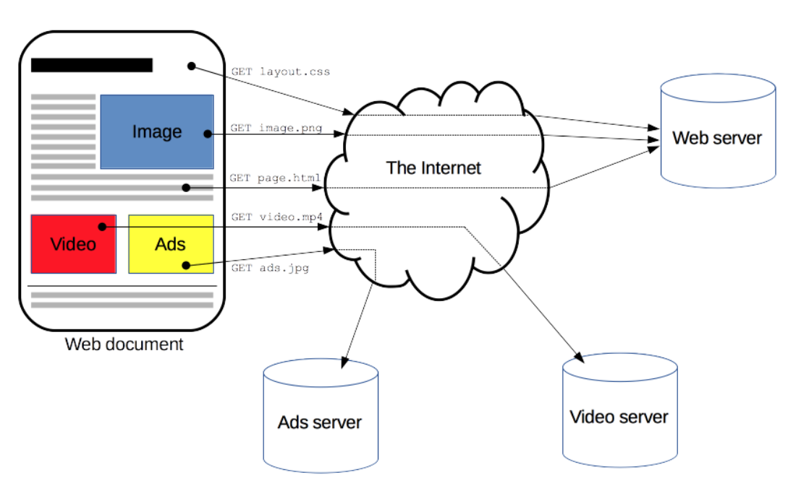
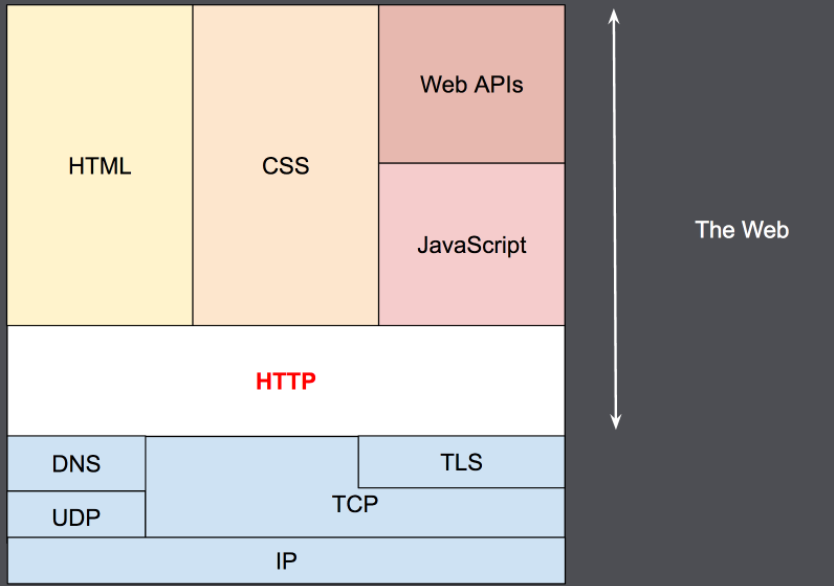
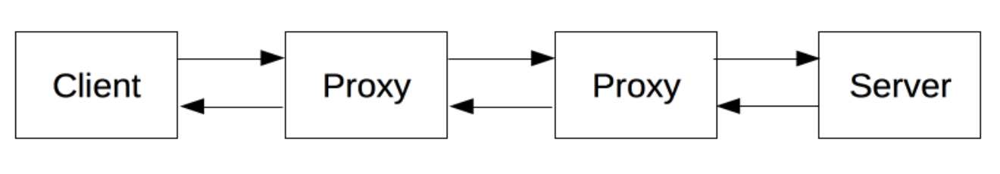
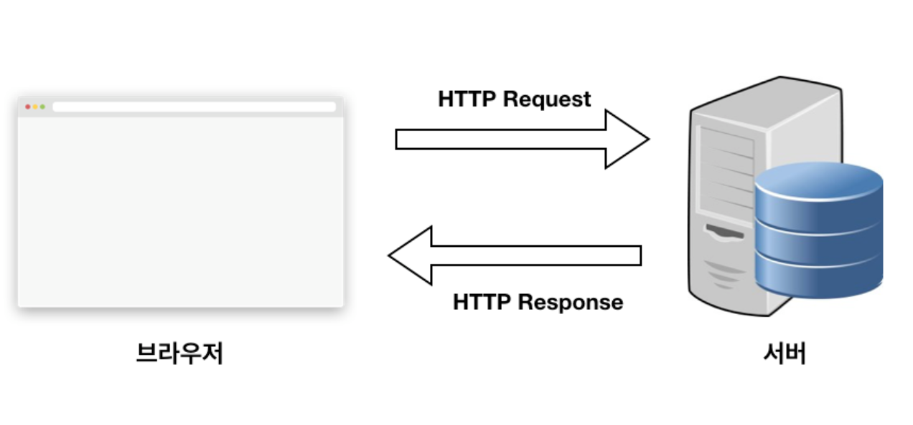
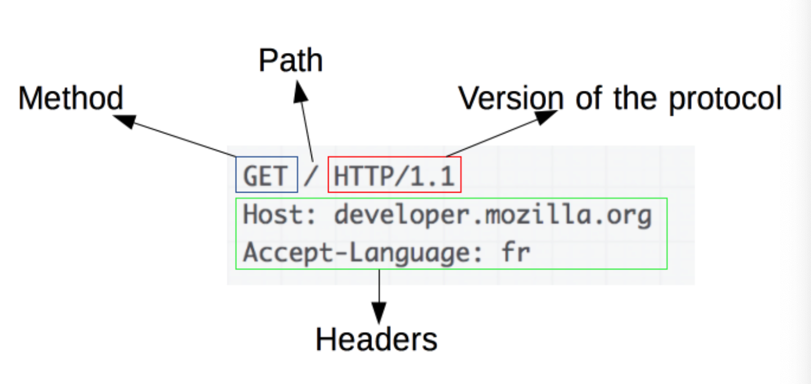
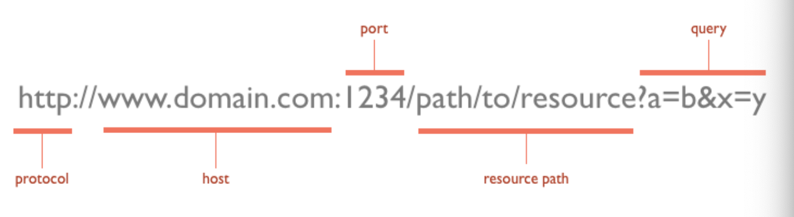
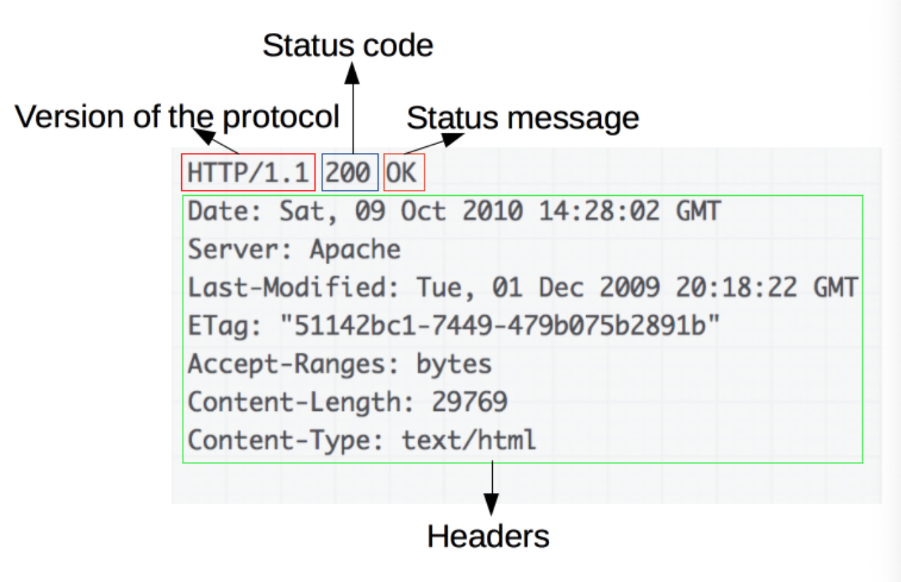

# 200927 TIL HTTP vs HTTPS part1

## Summary

---

1. [HTTP 개요](#1.-HTTP-개요)
2. [HTTP 기반 시스템의 구성요소](#2.-HTTP 기반 시스템의 구성요소)
3. [HTTP 특징](#3.-HTTP-특징)
4. [HTTP 흐름](#4.-HTTP-흐름)
5. [HTTP Message](#4.-HTTP-Message)
6. [HTTP Status Code](#6.-HTTP-Status-Code)

---

## Learning

## 1. HTTP 개요

---

* HTTP란?

  * Hyper Text Transfer Protocol

  * HTML 문서와 같은 리소스들을 가져올 수 있도록 해주는 통신 Protocol

    * Protocol?
      * 상호 간에 정의한 규칙

  * 모든 데이터 교환의 기초

  * 클라이언트 - 서버 Protocol

    

    * 클라이언트와 서버는 개별적인 메시지 교환에 의해 통신한다.
    * HTTP는 전송 프로토콜로 TCP 혹은 암호화된 TCP(TLS)를 통해 전송된다.

    

---

## 2. HTTP 기반 시스템의 구성요소

---

* 요청은 하나의 개체, 브라우저 혹은 프록시 등에 의해 전송된다. 각각 개별적인 요청은 서버로 보내지며, 서버에서는 요청을 처리하고 response 응답을 제공한다.

* 요청 응답 사이에는 다양한 작업을 수행하는 게이트웨이 또는 캐시 역할의 프록시 등이 존재할 수 있다.

  

  * 실제로는 라우터, 모뎀 등 다양한 컴퓨터가 존재한다. 하지만 네트워크와 전송 계층 내로 숨겨진다.
  * HTTP은 애플리케이션 계층의 최상위에 존재한다.

### 2-1. Client: 사용자 에이전트

---

* 사용자를 대신하여 동작하는 모든 도구. 주로 브라우저
* 브라우저는 항상 요청을 보내는 개체이다.
1. 페이지의 HTML 문서를 가져오기 위한 요청을 전송한 뒤, 
2. 파일을 구문 분석하여 실행해야 할 스크립트와 
3. 페이지 내 포함된 하위 리소스들을 잘 표시하기 위한 레이아웃 정보(CSS)에 대응하는 추가적인 요청들을 가져온다.
4. 웹 페이지에 표시하기 위해 리소스들을 혼합한다.
* 브라우저는 HTTP 요청 내에서 위의 지시 사항들을 변환하고 HTTP 응답을 해석하여 사용자에서 명확한 응답을 표시한다.

### 2-2. Web Server

---

* 클라이언트에 의한 요청에 대한 문서를 제공하는 서버가 존재하며, 논리적으로 단일 기계다.
  * 로드 or 로드 밸런싱, 컴퓨터(캐시, DB 서버 등) 들의 정보를 얻고 문서를 생성하는 서버들의 집합일 수도 있다.
  * 단일 머신일 필요는 없고, 여러 개의 서버를 동일한 머신 위에서 호스팅할 수 있다.
* HTTP/1.1과 Host 헤더를 이용하여, 동일한 IP 주소를 공유할 수도 있다.

### 2-3. Proxy

---

* 클라이언트와 서버 사이 에서는 수많은 컴퓨터/머신이 HTTP Message를 이어 받고 전달한다.
* 여러 계층으로 이루어진 웹 스택 구조에서 이러한 컴퓨터/머신들은 대부분 전송, 네트워크 혹은 물리 계층에서 동작하며, 성능에 큰 영향을 주지만 HTTP 계층에서는 이들이 어떻게 동작하는지 보이지 않는다.
* 이러한 컴퓨터/머신들 중에서도 애플리케이션 계층에서 동작하는 것들을 Proxy라고 한다.
  * 캐싱
  * 필터링
  * 로드 밸런싱
  * 인증
  * 로깅

---

## 3. HTTP 특징

---

* HTTP Protocol은 일반적으로 TCP/IP 통신 위에서 동작하며 Defalut Port는 80이다.

### 3-1. Stateless Protocol

---

* 데이터를 주고 받기 위한 데이터 요청이 서로 독립적으로 관리된다.
  * 즉, 이전 데이터 요청과 다음 데이터 요청이 서로 관련이 없다.
  * 세션과 같은 별도의 추가 정보를 관리하지 않아도 되고, 다수의 요청 처리 및 서버 부하를 줄일 수 있는 성능 상의 이점이 생긴다.
* 쇼핑 바구니 처럼 일관된 방식으로 사용자가 페이지와 상호작용할 경우 문제가 된다.
  * HTTP 쿠키는 상태가 있는 세션을 만든다.

### 3-2. HTTP와 연결

* 연결은 전송 계층에서 제어되므로 근본적으로 HTTP 영역 밖이다.
* HTTP는 연결될 수 있도록 하는 근본적인 전송 프로토콜을 요구하지 않는다.
* HTTP는 연결이 필수는 아니지만 연결 기반인 TCP 표준에 의존한다.
0. 클라이언트와 서버가 HTTP를 요청/응답으로 교환하기 전에 여러 왕복이 필요한 프로세스인 TCP 연결을 설정해야 한다.
1.  HTTP/1.0의 기본 동작은 각 요청/응답에 대해 별도의 TCP 연결을 여는 것이다.
	* 이 동작을 여러 요청을 연속해서 보내는 경우에 단일 TCP 연결을 공유하는 것보다 비효율적이다.
2. HTTP/1.1은 이러한 결함을 개선하기 위해 파이프라이닝 개념과 지속적인 연결 개념을 도입했다.
   * 기본적인 TCP 연결은 Connection 헤더를 사용해 부분적으로 제어할 수 있다.
3. HTTP/2는 연결을 좀 더 지속되고 효율적으로 유지하는데 도움이 되도록, 단일 연결 상에서 메시지를 다중 전송(multiplex)한다.

---

## 4. HTTP 흐름

---

1. TCP 연결을 연다. 

   * TCP 연결을 요청을 보내거나 응답을 받는데 사용된다. 
   * 클라이언트는 새 연결을 열거나, 기존 연결을 재사용하거나, 서버에 대한 여러 TCP 연결을 열 수 있다.

2. HTTP Message를 전송한다.

   * HTTP/2 이전의 Message는 사람이 읽을 수 있다.

   * 이후 Message는 프레임 속으로 캡슐화되어, 직접 읽는것은 불가능하다.

     ```
     GET / HTTP/1.1
     Host: developer.mozilla.org
     Accept-Language: fr
     ```

3. 서버에 의해 전송된 응답을 읽는다.

   ```
   HTTP/1.1 200 OK
   Date: Sat, 09 Oct 2010 14:28:02 GMT
   Server: Apache
   Last-Modified: Tue, 01 Dec 2009 20:18:22 GMT
   ETag: "51142bc1-7449-479b075b2891b"
   Accept-Ranges: bytes
   Content-Length: 29769
   Content-Type: text/html
   
   <!DOCTYPE html... (here comes the 29769 bytes of the requested web page)
   ```

4. 연결을 닫거나 다른 요청들을 위해 재사용한다.

* 파이프라이닝이 활성화되면, 첫번째 응답을 완전히 수신할 때까지 기다리지 않고 여러 요청을 보낼 수 있다.

## 5. HTTP Message

* 기존의 Message는 사람이 읽을 수 있었다.

* HTTP/2에서의 Message들은 새로운 이진 구조인 프레임 안으로 임베드되어, 헤더의 압축과 다중화와 같은 최적화를 가능하게 한다.

* 각 Message의 의미들은 변화하지 않기 때문에 HTTP/1.1 포맷 내에서 HTTP/2를 이해하는 것이 가능하다.

* HTTP Protocol로 데이터를 주고 받기 위해서는 Request를 보내고 Response를 받아야한다.

  

### 5-1. Request

---



* HTTP [Method](https://developer.mozilla.org/ko/docs/Web/HTTP/Methods)
  * 클라이언트가 수행하고자 하는 동작을 정의한 GET, POST, OPTIONS, HEAD 등
* Path
  * 가져오려는 리소스의 경로
  * Protocol(`http://`), 도메인(`developer.mozilla.org`), TCP Port(`80`)인 요소들을 제거한 리소스의 URL
* Version of the protocol
  * HTTP Protocol 버전
* Headers
  * 서버에 대한 추가 정보를 전달하는 선택적 헤더들

### 5-1-1. URL

---



### 5-1-2. Method

---

* HTTP Verbs
  * GET, POST, PUT, DELETE
* 기타
  * HEAD: 서버 헤더 정보를 획득. GET과 비슷하나 Response Body를 반환하지 않음
  * OPTIONS: 서버 옵션들을 확인하기 위한 요청. CORS에서 사용

### 5-2. Response

---



* Version of the protocol
  * HTTP Protocol 버전
* Status Code
  * 요청의 성공 여부와, 그 이유를 나타내는 [상태 코드](https://developer.mozilla.org/en-US/docs/Web/HTTP/Status)
* Status Message
  * 상태 코드의 짧은 설명을 나타내는 상태 메시지
* Headers
  * HTTP 헤더

## 6. HTTP Status Code

---

* 서버에서 설정해주는 Response 정보

### 6-1. 2xx - Success

---

* 대부분 성공을 의미
  * 200: GET 요청에 대한 성공
  * 204: No Content, 성공했으나 응답 본문에 데이터가 없음
  * 205: Reset Content, 성공했으나 클라이언트의 화면을 새로고침하도록 권고
  * 206: Partial Content, 성공했으나 일부 범위의 데이터만 반환

### 6-2. 3xx - Redirection

---

* 대부분 클라이언트가 이전 주소로 데이터를 요청하여 서버에서 새 URL로 리다이렉트를 유도하는 경우
  * 301: Moved Permanently, 요청한 자원이 새 URL에 존재
  * 303: See Other, 요청한 자원이 임시 주소에 존재
  * 304: Not Modified, 요청한 자원이 변경되지 않았으므로 클라이언트에서 캐싱된 자원을 사용하도록 권고, ETag와 같은 정보를 활용하여 변경 여부를 확인

### 6-3. 4xx - Client Error

---

* 대부분 클라이언트의 코드가 잘못된 경우. 유효하지 않은 자원을 요청했거나 요청이나 권한이 잘못된 경우 발생
  * 400: Bad Request, 잘못된 요청
  * 401: Unauthorized, 권한 없이 요청. Authorization 헤더가 잘못된 경우
  * 403: Forbidden, 서버에서 해당 자원에 대해 접근 금지
  * 405: Method Not Allowed, 허용되지 않은 요청 메서드
  * 409: Conflict, 최신 자원이 아닌데 업데이트 하는 경우. 파일 업로드시 버전 충돌

### 6-4. 5xx - Server Error

---

* 서버 쪽에서 오류가 난 경우
  * 501: Not Implemented, 요청한 동작에 대해 서버가 수행할 수 없는 경우
  * 503: Service Unavailable, 서버가 과부하 또는 유지 보수로 내려간 경우

---

## Reference
* [HTTP 개요](https://developer.mozilla.org/ko/docs/Web/HTTP/Overview)
* [프런트엔드 개발자가 알아야하는 HTTP 프로토콜 Part 1](https://joshua1988.github.io/web-development/http-part1/)
* [HTTP 프로토콜의 이해 — 1 (HTTP 정의, HTTP/1.1)](https://medium.com/@shaul1991/%EC%B4%88%EB%B3%B4%EA%B0%9C%EB%B0%9C%EC%9E%90-%EC%9D%BC%EC%A7%80-http-%ED%94%84%EB%A1%9C%ED%86%A0%EC%BD%9C%EC%9D%98-%EC%9D%B4%ED%95%B4-1-b9005a77e5fd)