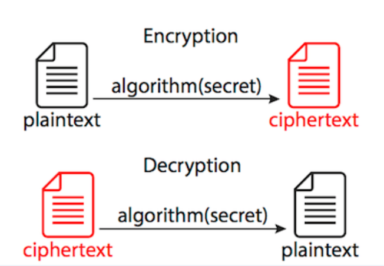
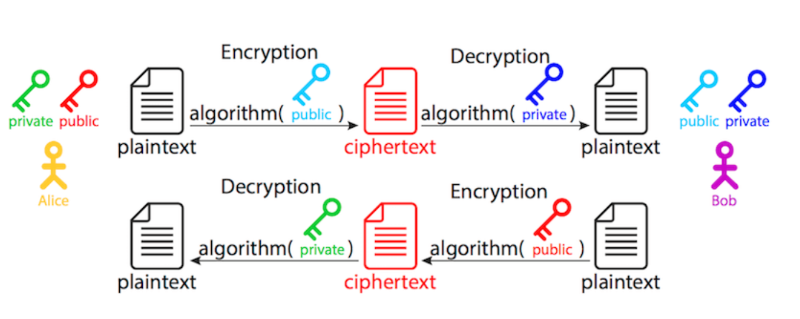

# 200928 TIL HTTP vs HTTPS part2

## Summary

---

1. [HTTPS란?](#1.-HTTPS란?)
2. [HTTPS 특징](#2.-HTTPS-특징)
3. [암호기술](#3.-암호기술)
4. [Handshacking](#4.-Handshacking)
5. [SSL/TLS](#5.-SSL/TLS)
6. [Apply HTTPS in Nginx](#5.-Apply-HTTPS-in-Nginx)

---

## Learning

---

## 1. HTTPS란?

---

* HTTPS(Hypertext Transfer Protocol Secure)란 사용자 컴퓨터와 방문한 사이트 간에 전송되는 사용자 데이터의 무결성과 기밀성을 유지할 수 있게 해주는 인터넷 통신 프로토콜이다.
* HTTP의 경우 데이터 교환시 정보를 평문으로 전송하므로 보안에 취약하다. 따라서 SSL(Secure Socket Layer)/TLS(Transport Layer Security)로 암호화시켜 메시지를 전송하여 정보 유출을 막는 HTTPS가 생겼다.

## 2. HTTPS 특징

---

### 2-1. 암호화

* 교환되는 데이터를 암호화하여 정보 교환 중 전송되는 message의 유출을 막는다.

---

### 2-2. 데이터 무결성

* 데이터가 전송되는 동안, 데이터가 변경되거나 손상되는 일을 방지한다. 즉, message가 조작되지 않음을 의미한다.

---

### 2-3. 인증

* 사용자가 의도된 웹사이트와 통신 중임을 입증합니다. 중간자 공격을 차단하고 사용자의 신뢰를 구축하게 되어 다른 비즈니스 이점으로 이어지게 된다.
* SSL 인증서를 통해 수신자가 예상하는 페이지에 정확하게 연결한다.

---

## 3. 암호기술

---

### 3-1. 암호화

* 대칭 키 알고리즘

  * 양쪽 당사자가 공통 비밀 키를 공유한다.
  * 올바른 키를 가진 사람만 해독가능하다.
  * 공유하기 어렵다는 문제가 있다. 일반적으로 보안 통신 채널이 필요하다.
  * 즉, 배포 방법에 주의해야된다. 

  

* 비대칭 키 알고리즘

  * 당사자 중 한쪽이 비밀 키와 공개 키의 쌍, 공개 키 인프라(PKI) 기반을 갖는다.
  * 공개 키는 다른 사람과 공유한다.
    * 엘리스가 밥에게 메시지를 보낼 경우, 밥의 공개키를 얻어 message를 암호화하고, 암호문을 밥에게 보낸다.
    * 밥은 개인 키를 사용해 암호문을 복호화한다.
    * 반대의 경우도 마찬가지

  

* 비대칭 암호화는 클라이언트와 서버 간 시크릿을 교환할 때 사용한다.

* 실생활에서는 대칭 암호화면 충분하다.

  * 공개 키로 암호화한 정보는 개인키를 사용해야만 복호화되기 때문에 클라이언트에서 서버로 향하는 단방향으로만 정보를 보호한다.
  * 즉, 서버에서만 그 정보를 복호화할 수 있고, 반대의 경우에는 보호되지 않는다.
  * 서버의 개인키로 암호화된 정보는 공개 키를 가진 누구든지 복호화할 수 있다.
  * 클라이언트는 서버의 공개 키를 사용해 무작위로 생성된 세션 시크릿을 암호화해 통신을 시작한다.
  * 그 다음 암호문을 다시 서버로 보내고, 서버는 다시 자신의 개인 키로 복호화하면 해당 시크릿을 갖게 된다.

* 대칭 암호화는 비대칭 암호화보다 훨씬 빠르기 때문에, 전송 중인 실제 데이터를 보호하는데 사용된다.

* 앞서 교환한 시크릿으로 정보를 가진 두 당사자만 해당 정보를 암호화하고 복호화할 수 있다.

* 따라서, 핸드셰이크의 첫 비대칭 부분이 키 교환이라고 불리며, 실제 암호화된 통신을 사이퍼 메서드 알고리즘을 사용한다.

---

## 4. Handshack

---

* 상호간 보안 연결 설정 시 서버와 클라이언트는 안전하게 의사 소통하는 방법에 동의해야한다.
* 이러한 협상 프로세스를 핸드 셰이크라고한다.

---

### 4-1. Handshack 과정

1. ClientHello(암호화 알고리즘 나열 및 전달)
2. ServerHello(암호화 알고리즘 선택)
3. Server Certificate(인증서 전달)
4. Client Key Exchange(데이터를 암호화할 대칭키 전달)
5. Client/ServerHello Done(정보 전달 완료)
6. Finished(SSL Handshake 종료)

* 해당 과정이 완료되면 클라이언트와 서버는 데이터를 암호화할 동일한 대칭키를 갖게되며, 서로에게 각자 가지고 있는 동일한 대칭키를 통해 데이터를 암호화하여 전송하게 된다.

---

## 5. SSL/TLS

---

### 5-1. SSL

* Secure Sockets Layer
  * 전송된 데이터를 암호화하여 인터넷 연결 보안을 유지하는 표준기술
  * 전송 계층 상에서 클라이언트, 서버에 대한 인증 및 데이터 암호화 수행
  * 클라이언트와 서버 간 응용계층 및 TCP 전송계층 사이에서 안전한 보안 채널을 형성해주는 보안 프로토콜

---

### 5-2. TLS

* Transpost Layer Security
  * SSL의 업그레이드 버전

---

## 6. Apply HTTPS in Nginx

---

1. Install letsencrypt

   ```bash
   $ sudo apt-get update -y & sudo apt-get install letsencrypt -y
   ```

2. 인증서 발급을 위해 실행 중인 nginx service 중지

   ```bash
   $ sudo systemctl stop nginx
   ```
   
3. 인증서 발급
   
   ```bash
   $ sudo letsencrypt certonly --standalone -d {domain name}
   ```
   
   * 정상 발급됐다면, certificate와 key값을 얻을 수 있다.
   
4. Nginx 설정파일 수정
   
   ```bash
   $ sudo vi /etc/nginx/site-available/default
   ```
   
   ```bash
   server {
           listen 80 default_server;
           listen [::]:80 default_server;
   
           server_name {domain name};
   				# 80 port로 들어오면 서버 측 301 HTTP 리디렉션을 사용하여 HTTPS 페이지(443 port)로 리디렉션
           return 301 https://$server_name$request_uri;
   
           index index.html index.htm index.nginx-debian.html;
   }
   
   server {
           listen 443 ssl;
           listen [::]:443 ssl;
   
           server_name j3a411.p.ssafy.io;
   				# 인증서 경로
           ssl_certificate /etc/letsencrypt/live/j3a411.p.ssafy.io/fullchain.pem;
           ssl_certificate_key /etc/letsencrypt/live/j3a411.p.ssafy.io/privkey.pem;
   				# dist 파일 경로
           root /home/ubuntu/s03p23a411/frontend/dist;
           index index.html index.htm index.nginx-debian.html;
   
           location / {
           				# /로 접근했을 때 빌드했던 dist의 index.html에 매핑
           				# 설정하지 않을경우 새로고침하면 404 not found error 발생
                   try_files $uri $uri/ /index.html;
           }
           # 프록시 서버 매핑.
           # 클라이언트로부터 요청이 들어오면 프록시 서버로 던져주고, 응답시 클라이언트로 던져준다.
           # 이때 WAS는 내부에서 백그라운드로 실행시켜서 연결한다.
           location /api {
                   proxy_pass http://localhost:8085/;
                   proxy_redirect off;
                   charset utf-8;
   
                   proxy_set_header X-Real-IP $remote_addr;
                   proxy_set_header X-Forwarded-For $proxy_add_x_forwarded_for;
                   proxy_set_header X-Forwarded-Proto $scheme;
                   proxy_set_header X-NginX-Proxy true;
           }
   }
   ```
   
5. Nginx 가동

   ```bash
   sudo systemctl start nginx
   ```

   

## Reference

---

* [HTTPS로 사이트 보안 유지](https://support.google.com/webmasters/answer/6073543?hl=ko)
* [HTTPS 작동 방식](https://howhttps.works/ko/)
* [HTTP에서 HTTPS로 전환하기 위한 완벽 가이드]([https://webactually.com/2018/11/http%EC%97%90%EC%84%9C-https%EB%A1%9C-%EC%A0%84%ED%99%98%ED%95%98%EA%B8%B0-%EC%9C%84%ED%95%9C-%EC%99%84%EB%B2%BD-%EA%B0%80%EC%9D%B4%EB%93%9C/](https://webactually.com/2018/11/http에서-https로-전환하기-위한-완벽-가이드/))
* [HTTPS 통신과정 쉽게 이해하기 #3]([https://aws-hyoh.tistory.com/entry/HTTPS-%ED%86%B5%EC%8B%A0%EA%B3%BC%EC%A0%95-%EC%89%BD%EA%B2%8C-%EC%9D%B4%ED%95%B4%ED%95%98%EA%B8%B0-3SSL-Handshake](https://aws-hyoh.tistory.com/entry/HTTPS-통신과정-쉽게-이해하기-3SSL-Handshake))
* [SSL/TLS, SSL, TLS  Secure Socket Layer, Transport Layer Security  안전 소켓 계층, 전송계층 보안](http://www.ktword.co.kr/abbr_view.php?m_temp1=1957)